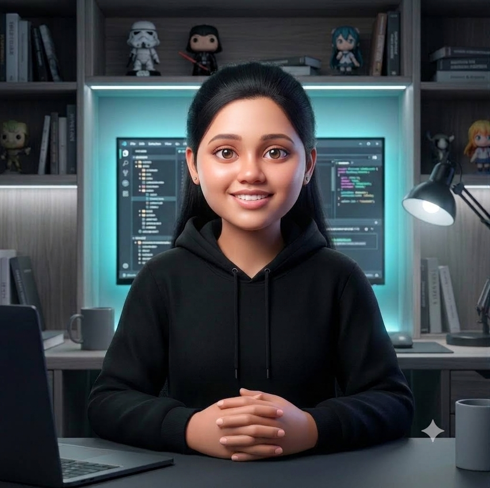

# Kiruthika R | Portfolio

A modern, cinematic portfolio website built for a B.Tech Information Technology student with a passion for full-stack development, AI, UI/UX, and real-world problem solving.

This project showcases technical projects, achievements, certifications, education, and interactive experiences in a polished single-page React portfolio.



## ✨ Highlights

- Modern one-page portfolio experience
- Animated hero section with cinematic video background
- Project showcase with featured engineering work
- Skills, achievements, education, and certifications sections
- Interactive UI transitions and polished visual design
- Responsive layout for desktop and mobile viewports
- Custom SkillLens experience embedded into the portfolio

## 🧩 Tech Stack

- React 19
- Vite
- JavaScript
- CSS3
- Lucide React icons
- HTML5

## 📁 Project Structure

```bash
portfolio/
├── src/
│   ├── components/
│   ├── App.jsx
│   ├── main.jsx
│   └── index.css
├── public/
│   └── video/
├── artifacts/
├── index.html
├── package.json
├── vite.config.js
├── .gitignore
└── README.md
```

## 🚀 Getting Started

### Prerequisites

- Node.js 18+
- npm

### Installation

```bash
git clone https://github.com/Kiruthika0607/portfolio.git
cd portfolio
npm install
npm run dev -- --host 0.0.0.0
```

Then open the local URL shown in the terminal, usually:

```bash
http://localhost:5173/
```

## 🏗️ Build for Production

```bash
npm run build
```

To preview the production build:

```bash
npm run preview -- --host 0.0.0.0
```

## 👩‍💻 About the Developer

Kiruthika R is an aspiring full-stack developer and AI enthusiast focused on building intelligent, user-friendly, and impactful digital experiences. Her work blends engineering fundamentals, creativity, and practical application across software development, design thinking, and emerging technologies.

## 🌟 Featured Work

- SkillLens — Industry-skill demand aggregator and career-path mapping platform
- QR Code Student Attendance System — hackathon-winning full-stack solution
- Tasty Bites Website — modern restaurant portal with strong UX design
- Digitalization of DISA Production Records — process digitization project
- GeoAudit — verification system for fitness certification records

## 📬 Connect

- GitHub: https://github.com/Kiruthika0607
- Portfolio Repository: https://github.com/Kiruthika0607/portfolio

## 📝 License

This project is open for learning, adaptation, and portfolio inspiration. Please respect the original work and provide attribution where appropriate.

## 🤝 Acknowledgements

Special thanks to the communities, mentors, and hackathon experiences that shaped this project and the learning journey behind it.
